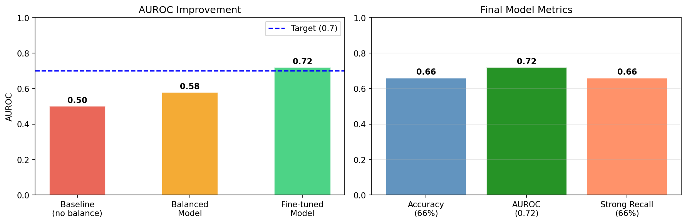

# 🧬 Drug-Target Interaction Prediction using GNN

A deep learning project that predicts drug-target interactions using Graph Neural Networks (GNN) on the DAVIS dataset.

## 🎯 Objective
Predict whether a drug molecule will bind to a target protein using GNN-based deep learning — helping accelerate drug discovery for cancer treatment.

## 🧪 Dataset
- **DAVIS Dataset** — 68 drugs, 379 proteins, 30,056 interaction pairs
- Source: DeepPurpose library
- Binary labels: Strong binding (pKd ≥ 30) vs Weak binding

## 🏗️ Model Architecture
- **Drug Encoder** — 3-layer GCN (Graph Convolutional Network)
  - SMILES → Molecular Graph → 128-dim embedding
- **Protein Encoder** — 2-layer MLP
  - Amino acid sequence → 128-dim embedding  
- **Classifier** — Fully connected layers with dropout
  - Combined 256-dim → Binary prediction

## 📊 Results

| Model | AUROC | Accuracy | Strong Recall |
|-------|-------|----------|---------------|
| Baseline | 0.50 | 95% | 0% |
| Balanced Model | 0.58 | 30% | 89% |
| Fine-tuned Model | **0.72** | **66%** | **66%** |

## 🛠️ Tech Stack
- Python, PyTorch, PyTorch Geometric
- RDKit, DeepPurpose, Scikit-learn
- Google Colab (T4 GPU)

## 🚀 How to Run
1. Open `DTI_Day1.ipynb` in Google Colab
2. Runtime → Change runtime type → T4 GPU
3. Run all cells sequentially
4. Results saved automatically as `final_results.png`

## 🔬 Key Findings
- GNN successfully learns drug molecular structure from SMILES
- Class imbalance handling improved strong binding recall from 0% → 66%
- AUROC improved from 0.50 (random) → 0.72 after fine-tuning

## 🔮 Future Work
- Larger dataset (BindingDB)
- Attention mechanism for better interpretability
- Protein structure (3D) integration
- Clinical validation

## 👤 Author
Deepika | Bioinformatics + Data Science
